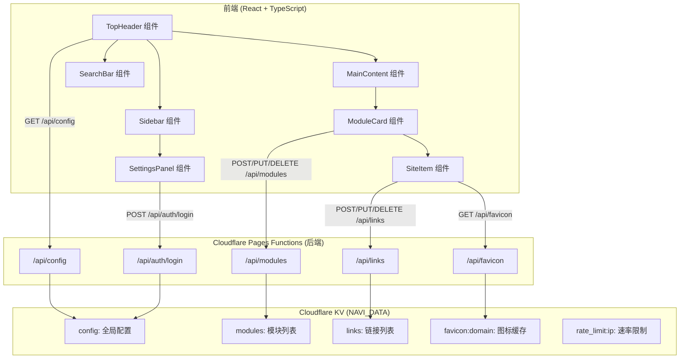

# 猫叔有段位•星航 — 技术架构文档

## 1. 架构设计



## 2. 技术说明
- **前端**：React@18 + TypeScript + Tailwind CSS@3 + Vite
- **初始化工具**：vite-init (react-ts 模板)
- **后端**：Cloudflare Pages Functions（/functions 目录，无需 Express）
- **存储**：Cloudflare KV（绑定名 NAVI_DATA）
- **状态管理**：Zustand
- **动画**：Framer Motion
- **拖拽**：@dnd-kit/core + @dnd-kit/sortable
- **图标**：lucide-react
- **认证**：JWT（jsonwebtoken 兼容库）+ bcryptjs

## 3. 路由定义
| 路由 | 用途 |
|------|------|
| / | 导航主页（单页应用，所有功能在同一页面） |

## 4. API 定义

### 4.1 公开 API
| 方法 | 路径 | 说明 | 请求体 | 响应 |
|------|------|------|--------|------|
| GET | /api/config | 获取站点配置 | - | `{ title, fontFamily, fontSize, dateFormat, showSeconds, showWeekday, bgImage, defaultEngine, theme }` |
| GET | /api/favicon?url= | 获取网站图标 | - | Base64 编码图片 |
| POST | /api/auth/login | 管理员登录 | `{ password }` | `{ token }` 或 401 |

### 4.2 管理 API（需 JWT 认证）
| 方法 | 路径 | 说明 | 请求体 | 响应 |
|------|------|------|--------|------|
| PUT | /api/config | 更新全局配置 | 配置对象 | `{ ok: true }` |
| POST | /api/modules | 新增模块 | `{ name, icon, order }` | `{ id, ... }` |
| PUT | /api/modules/:id | 编辑模块 | `{ name?, icon?, order? }` | `{ ok: true }` |
| DELETE | /api/modules/:id | 删除模块 | - | `{ ok: true }` |
| POST | /api/links | 新增链接 | `{ moduleId, name, url, order }` | `{ id, ... }` |
| PUT | /api/links/:id | 编辑链接 | `{ name?, url?, order? }` | `{ ok: true }` |
| DELETE | /api/links/:id | 删除链接 | - | `{ ok: true }` |

### 4.3 TypeScript 类型定义

```typescript
// 站点配置
interface SiteConfig {
  title: string;
  fontFamily: string;
  fontSize: string;
  dateFormat: string;
  showSeconds: boolean;
  showWeekday: boolean;
  bgImage: string;
  defaultEngine: 'bing' | 'baidu';
  theme: 'dark' | 'light' | 'eye-care' | 'system';
}

// 模块
interface Module {
  id: string;
  name: string;
  icon: string; // emoji
  order: number;
  collapsed: boolean;
}

// 链接
interface Link {
  id: string;
  moduleId: string;
  name: string;
  url: string;
  favicon?: string; // base64 或 URL
  order: number;
}
```

## 5. 数据模型

### 5.1 KV 存储结构
| Key | Value | 说明 |
|-----|-------|------|
| `config` | JSON (SiteConfig) | 全局配置 |
| `modules` | JSON (Module[]) | 模块列表（含排序） |
| `links` | JSON (Link[]) | 链接列表（含排序） |
| `favicon:{domain}` | Base64 字符串 | 图标缓存（TTL 30天） |
| `rate_limit:{ip}` | 计数字符串 | 速率限制（TTL 60秒） |

### 5.2 初始数据
```json
{
  "config": {
    "title": "猫叔有段位•星航",
    "fontFamily": "Outfit",
    "fontSize": "3xl",
    "dateFormat": "YYYY年M月D日",
    "showSeconds": true,
    "showWeekday": true,
    "bgImage": "",
    "defaultEngine": "bing",
    "theme": "dark"
  },
  "modules": [
    { "id": "m1", "name": "办公工具", "icon": "💼", "order": 0, "collapsed": false },
    { "id": "m2", "name": "学习资源", "icon": "📚", "order": 1, "collapsed": false },
    { "id": "m3", "name": "设计开发", "icon": "🎨", "order": 2, "collapsed": false },
    { "id": "m4", "name": "影音娱乐", "icon": "🎬", "order": 3, "collapsed": false }
  ],
  "links": [
    { "id": "l1", "moduleId": "m1", "name": "Google Docs", "url": "https://docs.google.com", "order": 0 },
    { "id": "l2", "moduleId": "m1", "name": "Notion", "url": "https://notion.so", "order": 1 },
    { "id": "l3", "moduleId": "m2", "name": "MDN", "url": "https://developer.mozilla.org", "order": 0 },
    { "id": "l4", "moduleId": "m3", "name": "Figma", "url": "https://figma.com", "order": 0 },
    { "id": "l5", "moduleId": "m3", "name": "GitHub", "url": "https://github.com", "order": 1 },
    { "id": "l6", "moduleId": "m4", "name": "YouTube", "url": "https://youtube.com", "order": 0 },
    { "id": "l7", "moduleId": "m4", "name": "Bilibili", "url": "https://bilibili.com", "order": 1 }
  ]
}
```

## 6. 安全架构

### 6.1 认证流程
1. 首次访问：检查 KV 中 `admin_password_hash` 是否存在
2. 不存在 → 返回需要设置密码的标识 → 前端显示设置密码界面
3. 设置密码 → bcrypt 哈希后存入 KV（key: `admin_password_hash`）
4. 登录 → bcrypt 验证 → 签发 JWT（7天有效，密钥为环境变量 JWT_SECRET）
5. 管理 API → 验证 JWT Bearer Token

### 6.2 速率限制
- `/api/auth/login`：每 IP 每分钟 5 次
- `/api/favicon`：每 IP 每分钟 20 次
- 使用 KV 存储 `rate_limit:{ip}` 计数器（TTL 60秒）

### 6.3 安全头
- Content-Security-Policy: default-src 'self'; img-src 'self' data: https:; style-src 'self' 'unsafe-inline'; font-src 'self' https://fonts.googleapis.com https://fonts.gstatic.com
- X-Frame-Options: DENY
- X-Content-Type-Options: nosniff

### 6.4 输入校验
- 所有字符串输入 strip HTML 标签
- URL 校验格式
- 模块名/链接名长度限制 50 字符
